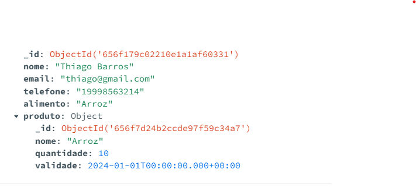

## Nosso exemplo de aggregate 
  

  
db.Requerentes.aggregate([ 
  { 
    $match: { 
      _id: ObjectId("ID_EXEMPLO")  
    } 
  }, 
  { 
    $lookup: { 
      from: "Produtos",  
      localField: "alimento", 
      foreignField: "nome", 
      as: "produto" 
    } 
  }, 
  { 
    $unwind: "$produto"
  },
  {
    $set: {
      "produto.nome": "Feijão" 
    }
  },
  { 
    $merge: {
      into: "Requerentes", 
      whenMatched: "merge", 
      whenNotMatched: "insert" 
    }
  }
]);

