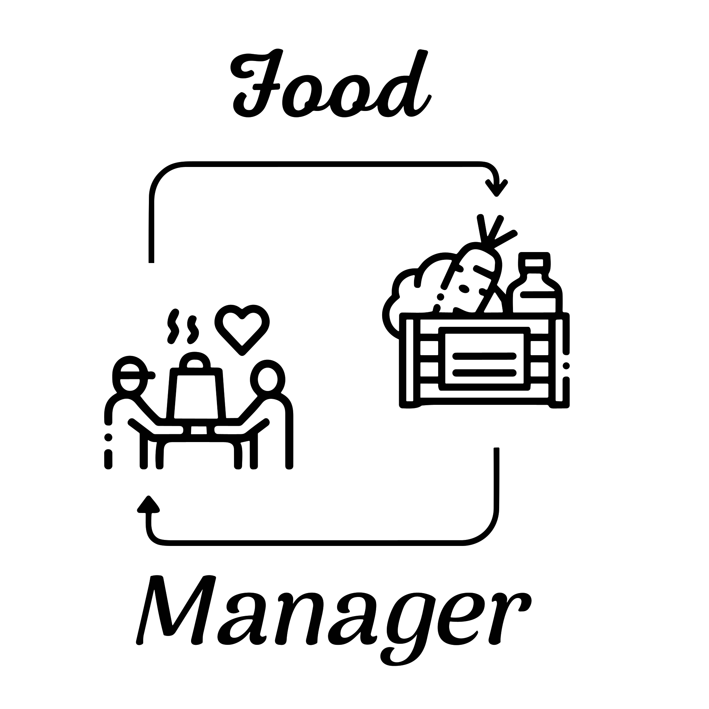
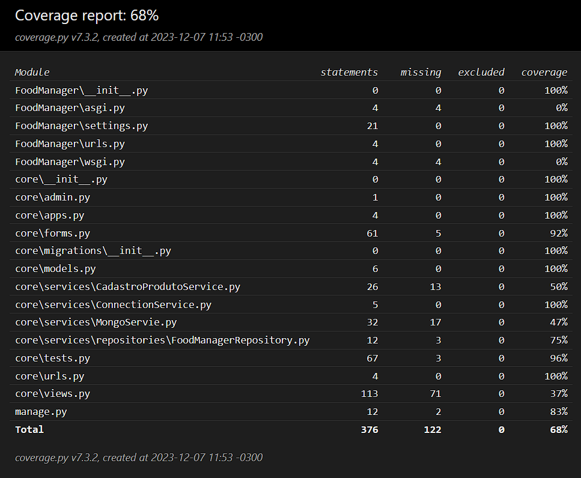

# Food Manager
## Sistema de Gerenciamento de Doações de Alimentos

O nosso sistema visa facilitar o gerenciamento de doações, estoques e distribuições de alimentos para organizações de caridade e bancos de alimentos.

## Visão Geral

Muitas instituições lidam com uma variedade de produtos com datas de validade diversas. O gerenciamento manual desses alimentos resulta frequentemente em falhas, levando a distribuições inadequadas. Através do nosso sistema, buscamos resolver esse problema, proporcionando:

- **Controle de Inventário Eficiente**
- **Priorização de Alimentos**
- **Agilidade na Distribuição**

## Funcionalidades Principais

1. **Registro de Doações**
2. **Gerenciamento de Estoque**
3. **Priorização Inteligente**
4. **Rastreamento de Distribuição**

## Como Contribuir

1. Faça um fork do repositório.
2. Clone o repositório forkado para sua máquina local.
3. Crie uma branch para a sua contribuição.
4. Faça as alterações necessárias e commit-as.
5. Faça push das alterações para o seu fork.
6. Abra um Pull Request no repositório original.

## Tecnologias Utilizadas

- Linguagem: [Python]
- Frameworks: [Django]
- Banco de Dados: [Mongo DB]
- Outras Ferramentas:
  + asgiref==3.7.2
  + backports.zoneinfo==0.2.1
  + Django==4.0.1 
  + dnspython==2.4.2
  + pymongo==3.12.1
  + pytz==2023.3.post1
  + sqlparse==0.2.4
  + typing-extensions==4.8.0
  + tzdata==2023.3

## Equipe

+ Vitor C Fellzatti.
+ Thiago Barros.
+ Thiago Rodrigo.
+ Vinicius Nigras.
+ Vitor Carvalho.
---  
## Logo

---
## Coverage

Este README está sujeito a alterações à medida que o projeto evolui.

